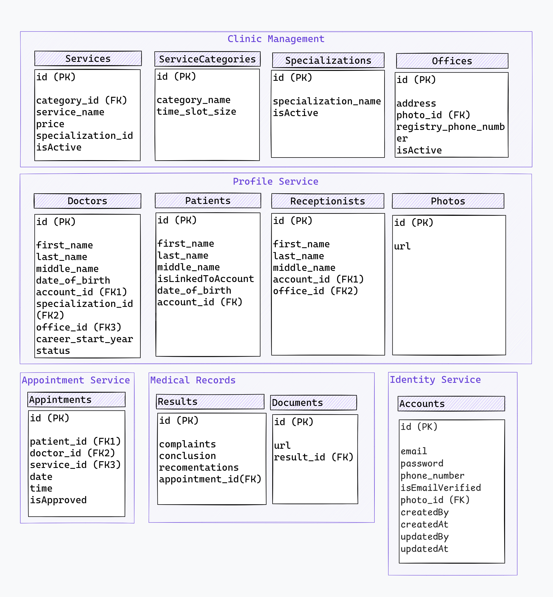
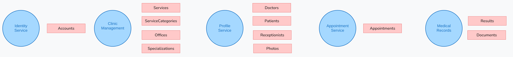

# dotnet-inno-clinic
Innowise Clinic ASP.NET Core Web API (Pre-Trainee Innowise assignment) 

## Схема сущностей представленных в базах данных, распределенных по соответствующим сервисам

<b>📸 Показать схему бд</b>

   
  

    
  

 
Соответсвенно распределение по Bounded Context будет следующим

<b>📸 Показать BC</b>

   
  

    
  

### 👤 Identity Service 
Микросервис, отвечающий за управление регистрацией пользователей.

  
<b>📸 Показать схему домена Account</b>

   
  

    
  

### 📦 Product Management Service
Микросервис каталога товаров. Управляет продуктами, категориями, ценами и списками желаемого. Хранит денормализованную реплику данных о продавце для оптимизации чтения.

  
<b>📸 Показать схему домена Product</b>

   
  

    
  

---
