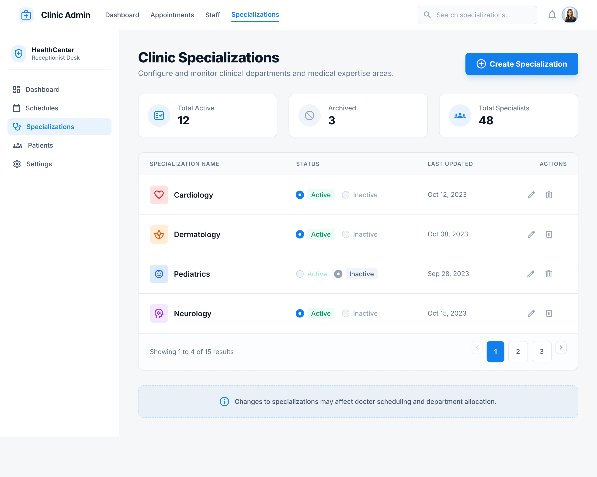
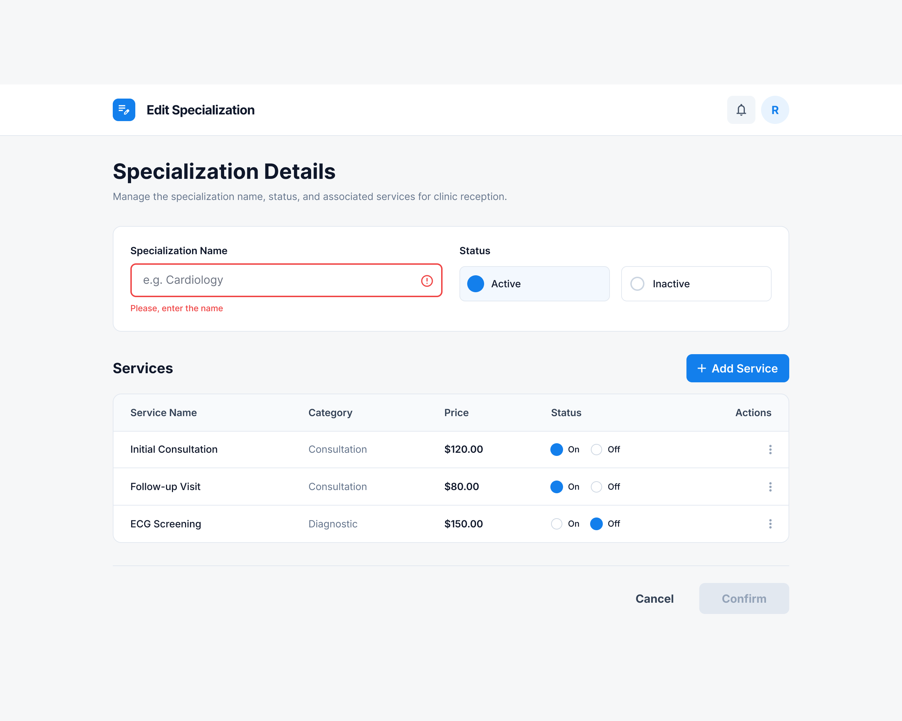
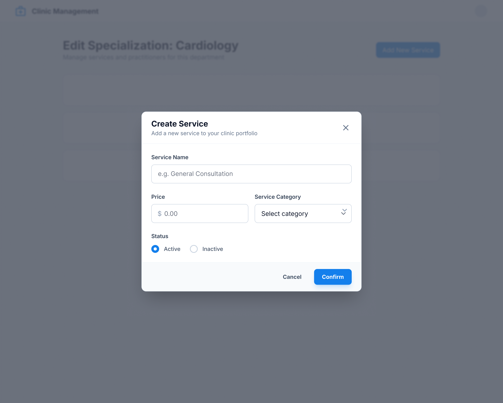

Так как я совместила Office API и Services API

Специализации, сервисы и категории относятся к Services API

Соотвестственно что мы имеем
Мы находимся на странице специализаций и можем создать таковую
На странице специализаций у нас выводится список специализаций

При нажатии мы отправляемся в Cretae Specialization и видим там несколько полей

В то же время мы можем добавить сервис это будет выглядить как-то так

где мы можем выбрать категорию

Существуют только три типа предустановленных категорий

- analyses
- consultation
- diagnostics

Анализы занимают один слот
Консультация два слота
Диагностика три слота

Причем каждый слот - это десять минут

Специализация это как "Кардиология" допустим
А уже из нее наследуются сервисы (Услуги)
ЭКГ
Прием кардиолога

При создании специализации у нас должна быть хоть какая-то услуга

# important
На фронте надо будет обработать такую штуку, что у нас на экране создания специализации надо сначала создать сервис(услугу) и получаетсяч если мы закрываем окно создания специализации когда уже создали сервисы, то надо обработать то, что мы все сервисы удаляем так как не может быть такого кейса что сервисы есть а специализации нету
Получается мы изначально когда привязываем 